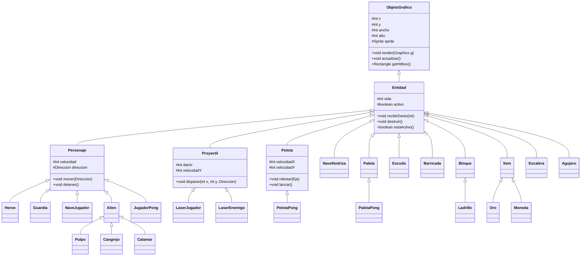
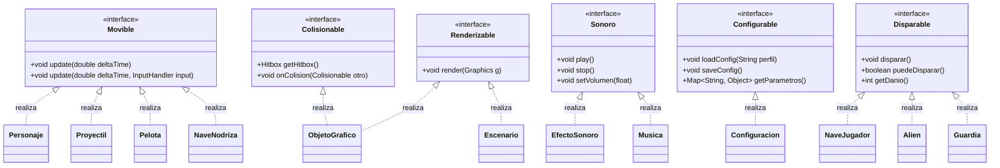

# 🧩 Esqueleto Completo del Proyecto — POO (UML + PDF 2026)

> Documento sintético que describe la arquitectura **completa** del proyecto integrador, obtenida cruzando el diagrama de clases UML (StarUML) y el PDF de la especificación.  
> Basado exclusivamente en el **paradigma de Orientación a Objetos**: encapsulamiento, herencia, polimorfismo, abstracción.

---

## 1. 📦 Estructura de Paquetes

```
py_poo/
├── core/                     # Clases de entrada, bucle principal, gestores
├── engine/                   # Motor abstracto del juego (Juego, Nivel, Escena)
├── interfaces/               # Interfaces de comportamiento (Movible, Renderizable, etc.)
├── entities/                 # Entidades base del juego (Entidad, Personaje, Proyectil, etc.)
├── graphics/                 # Sistema de renderizado, sprites, animaciones
├── audio/                    # Gestión de sonido y música
├── input/                    # Manejo de entrada, comandos, mapeo de teclas
├── collision/                # Detección y gestión de colisiones
├── ranking/                  # Sistema de puntuación y rankings
├── config/                   # Configuración global y por juego
├── utils/                    # Utilidades (Vector2D, Puntaje, Archivos)
├── ui/                       # Interfaz de usuario (Menús, HUD, Marcador)
├── loderunner/               # Implementación de Lode Runner
├── spaceinvaders/            # Implementación de Space Invaders
└── pong/                     # Implementación de Pong
```

---

## 2. 🏗️ Diagrama de Paquetes (Mermaid)


---

## 3. 🧬 Jerarquía de Herencia (Mermaid)



---

## 4. 🎯 Interfaces y Realizaciones



---

## 5. 🧠 Clases del Núcleo (`py_poo.core`)

| Clase | Estereotipo | Descripción |
|-------|-------------|-------------|
| `Main` | «main» | Punto de entrada. Inicializa ventana, loading y lanza `GameLoop`. |
| `GameLoop` | «controller» | Bucle principal (FPS fijo, update-render). Gestiona `EstadoJuego`. |
| `GestorJuegos` | «controller» | Factoría de juegos. Registra las 3 implementaciones concretas. |
| `GestorEscenas` | «controller» | Pila de escenas. Push/pop/replace de menús y partidas. |
| `Constantes` | «utility» | Constantes globales: tamaño ventana, FPS objetivo, rutas archivos. |

### `GameLoop` — Flujo principal

```
while (running) {
    procesarInput()
    actualizar(deltaTime)    // delega a GestorEscenas → Escena activa
    renderizar()             // delega al Renderer
    sincronizarFPS()
}
```

---

## 6. ⚙️ Motor Abstracto (`py_poo.engine`)

### `Juego` (abstracta — «copia» por juego)

```java
public abstract class Juego implements Configurable {
    protected String nombre;
    protected int nivelActual;
    protected int puntajeMaximo;
    protected GestorNiveles gestorNiveles;
    protected Ranking ranking;
    protected Configuracion config;

    public abstract void iniciar();
    public abstract void pausar();
    public abstract void reanudar();
    public abstract void reiniciar();
    public abstract void terminar();
    public abstract Nivel crearNivel(int numero);
    public abstract void guardarPuntaje(String jugador, int puntaje);
}
```

Implementaciones concretas:
- `JuegoLodeRunner` (pakete `loderunner`)
- `JuegoSpaceInvaders` (pakete `spaceinvaders`)
- `JuegoPong` (pakete `pong`)

### `Nivel` (abstracta — «copia» por juego)

```java
public abstract class Nivel {
    protected int numero;
    protected Escenario escenario;
    protected List<Entidad> entidades;
    protected Jugador jugador;
    protected boolean completado;
    protected int puntajeNivel;

    public abstract void cargar();
    public abstract void update(double deltaTime);
    public abstract void render(Graphics g);
    public abstract boolean condicionesVictoria();
    public abstract boolean condicionesDerrota();
}
```

### `Escena` (abstracta)

```java
public abstract class Escena {
    protected boolean activa;
    protected GestorEscenas gestor;

    public abstract void inicializar();
    public abstract void update(double deltaTime);
    public abstract void render(Graphics g);
    public abstract void destruir();
}
```

### `EstadoJuego`

Enumeración de estados: `MENU_PRINCIPAL`, `JUGANDO`, `PAUSADO`, `GAME_OVER`, `RANKING`, `CONFIGURACION`.

### `Temporizador`

Utilidad para eventos temporizados (power-ups, movimiento enemigos, spawns).

### `Camara`

Sistema de cámara con `x, y`, `zoom`, métodos `seguir(Entidad)`, `shake()`.

---

## 7. 🧩 Entidades (`py_poo.entities`)

### `Entidad` (base abstracta)

| Atributo | Tipo | Descripción |
|----------|------|-------------|
| `x, y` | `int` | Posición |
| `ancho, alto` | `int` | Dimensiones |
| `vida` | `int` | Puntos de vida |
| `activo` | `boolean` | Si sigue en juego |
| `sprite` | `Sprite` | Representación visual |

### `Personaje` → `Heroe`, `Guardia`, `NaveJugador`, `Alien`, `JugadorPong`

Extiende `Entidad`. Añade:
- `velocidad: int`
- `direccion: Direccion` (enum: `ARRIBA`, `ABAJO`, `IZQUIERDA`, `DERECHA`, `NINGUNA`)
- `mover(Direccion)`, `detener()`

### `Proyectil` → `LaserJugador`, `LaserEnemigo`

| Atributo | Descripción |
|----------|-------------|
| `danio: int` | Puntos de daño al impactar |
| `velocidadY: int` | Velocidad vertical |
| `direccion: Direccion` | Hacia dónde viaja |

### `Pelota` → `PelotaPong`

| Atributo | Descripción |
|----------|-------------|
| `velocidadX: int` | Velocidad horizontal |
| `velocidadY: int` | Velocidad vertical |
| `rebotar(Eje)` | Invierte velocidad en el eje X o Y |
| `lanzar()` | Pone la pelota en movimiento |

### `Paleta` → `PaletaPong`

Compuesta por `Segmento` (8 segmentos con colisiones individuales).

### `Bloque` → `Ladrillo`

Bloque sólido o destruible. Usado en Lode Runner y Space Invaders.

### `Escalera`, `Agujero`

Elementos de Lode Runner. `Agujero` cambia estado al pasar el héroe.

### `Item` → `Oro`, `Moneda`

Objetos coleccionables. Al tocarlos: puntaje, power-up o condición de victoria.

---

## 8. 🎨 Sistema Gráfico (`py_poo.graphics`)

| Clase | Descripción |
|-------|-------------|
| `Renderer` | Motor de renderizado principal (colas de sprites, capas). |
| `Sprite` | Imagen/textura con posición, rotación, escalado. |
| `Animacion` | Secuencia de sprites en bucle. |
| `CamaraObservador` | Implementa `Observer` para seguir entidades. |
| `FXPlayer` | Reproduce efectos visuales (explosiones, destellos). |

---

## 9. 🔊 Sistema de Audio (`py_poo.audio`)

| Clase | Descripción |
|-------|-------------|
| `AudioManager` | Singleton. Carga, mezcla y reproduce sonidos/música. |
| `EfectoSonoro` | Sonido corto (disparo, salto, recolección). Implementa `Sonoro`. |
| `Musica` | Pista larga (background por nivel). Implementa `Sonoro`. |

---

## 10. 🎮 Sistema de Entrada (`py_poo.input`)

| Clase | Descripción |
|-------|-------------|
| `InputHandler` | Procesa teclado/mouse/joystick. Provee métodos como `isKeyPressed(Key)`. |
| `Comando` | Patrón Command. Encapsula acciones (saltar, disparar, pausar). |
| `MapeoTeclas` | Mapa de teclas a comandos. Configurable por juego. |

---

## 11. 💥 Sistema de Colisiones (`py_poo.collision`)

| Clase | Descripción |
|-------|-------------|
| `GestorColisiones` | Detecta colisiones entre entidades (AABB). |
| `Colision` | Objeto de evento: `entidadA`, `entidadB`, `puntoImpacto`. |
| `Hitbox` | Rectángulo de colisión con offset. |

---

## 12. 🏆 Sistema de Ranking y Puntaje (`py_poo.ranking`)

| Clase | Descripción |
|-------|-------------|
| `Ranking` | Lista ordenada de `EntradaRanking`. Métodos: `agregar()`, `obtenerTop(n)`. |
| `EntradaRanking` | `jugador: String`, `puntaje: int`, `nivel: int`, `fecha: LocalDateTime`. |
| `GestorRanking` | Carga/guarda rankings en archivo JSON. |

---

## 13. ⚙️ Sistema de Configuración (`py_poo.config`)

| Clase | Descripción |
|-------|-------------|
| `Configuracion` | Parámetros comunes sensitivos (`volumen`, `dificultad`, `controles`, `idioma`). |
| `GestorConfig` | Persistencia en `config.properties` o JSON. |

Implementa `Configurable`.

---

## 14. 🛠️ Utilidades (`py_poo.utils`)

| Clase | Descripción |
|-------|-------------|
| `Vector2D` | `x, y: double`. Métodos: `sumar()`, `restar()`, `normalizar()`, `distancia()`. |
| `Puntaje` | `valor: int`, `nivel: int`, `fecha: LocalDateTime`, `jugador: String`. |
| `PuntajeComparator` | Compara `Puntaje` por valor descendente. |
| `GestorArchivos` | Lee/escribe archivos de datos (ranking, config, mapas). |

---

## 15. 🖥️ Interfaz de Usuario (`py_poo.ui`)

| Clase | Descripción |
|-------|-------------|
| `MenuPrincipal` | Escena: botones "Jugar", "Ranking", "Configuración", "Salir". |
| `MenuPausa` | Escena superpuesta: "Reanudar", "Reiniciar", "Salir al menú". |
| `PantallaGameOver` | Muestra puntaje final, opción a ranking o reinicio. |
| `HUD` | Overlay durante la partida: vidas, puntaje, nivel. Se adapta por juego. |
| `Boton` | Elemento UI clickeable con texto, sprite, callback. |
| `Marcador` | Tabla de puntajes en partidas de Pong. |

---

## 16. 🎮 Implementaciones Concretas por Juego

### 16.1 🟦 Lode Runner (`py_poo.loderunner`)

| Clase | Padre | Atributos/Métodos Clave |
|-------|-------|--------------------------|
| `JuegoLodeRunner` | `Juego` | `niveles: List<NivelLodeRunner>`, `iniciar()`, `crearNivel(int)` |
| `Heroe` | `Personaje` | `vidas: int`, `oroRecolectado: int`, `cavar()`, `recolectarOro()`, `subirEscalera()`, `estaAtrapado()` |
| `Guardia` | `Personaje` | `ia: IA_Guardia`, `estado: EstadoGuardia` (PATRULLAR, PERSEGUIR, BUSCAR) |
| `NivelLodeRunner` | `Nivel` | `mapa: int[][]`, `ladrillos: List<Ladrillo>`, `escaleras: List<Escalera>`, `oros: List<Oro>`, `agujeros: List<Agujero>`, `heroe: Heroe`, `guardias: List<Guardia>` |
| `IA_Guardia` | — | `nivel: NivelLodeRunner`, `actualizar(Heroe)`, `buscarRuta()`, `escaleras()` |
| `EscenarioLodeRunner` | `ObjetoGrafico` | Renderiza el nivel con tiles. |
| `Ladrillo` | `Bloque` | `destruible: boolean`, `seCae: boolean` |
| `Oro` | `Item` | `valor: int = 100` |
| `AgujeroLR` | `Agujero` | `temporal: boolean`, `duracion: int` (en ms) |
| `EscaleraLR` | `Escalera` | `visible: boolean` |

**Mecánicas clave del PDF:**
- Héroe puede cavar agujeros para atrapar guardias.
- Guardias con IA de 3 estados: PATRULLAR (ruta fija), PERSEGUIR (persigue al héroe si lo ve), BUSCAR (busca en última posición conocida).
- Recolectar todo el oro para avanzar de nivel.
- Caer en agujero o ser tocado por guardia = perder vida.

### 16.2 🛸 Space Invaders (`py_poo.spaceinvaders`)

| Clase | Padre | Atributos/Métodos Clave |
|-------|-------|--------------------------|
| `JuegoSpaceInvaders` | `Juego` | `oleadas: int`, `puntajeCombo: int`, `iniciar()`, `crearNivel(int)` |
| `NaveJugador` | `Personaje` | `vidas: int`, `poderFuego: int`, `disparar()`, `moverse(Direccion)` |
| `Alien` | `Personaje` | `puntaje: int`, `tipo: TipoAlien`, `disparar()` |
| `Pulpo` | `Alien` | `puntaje = 10`, sprite más pequeño |
| `Cangrejo` | `Alien` | `puntaje = 20` |
| `Calamar` | `Alien` | `puntaje = 30`, sprite más grande |
| `NaveNodriza` | `Entidad` | Aparece esporádicamente, `puntaje = 50-300`, movimiento horizontal |
| `LaserJugador` | `Proyectil` | `danio = 1`, `velocidadY = -8` |
| `LaserEnemigo` | `Proyectil` | `danio = 1`, `velocidadY = 4` |
| `Escudo` | `Entidad` | Protege al jugador, `vida = 3` (se destruye progresivamente) |
| `NivelSpaceInvaders` | `Nivel` | `formacion: Alien[][]`, `movimientoFormacion: Direccion`, `velocidadFormacion: double`, `oleada: int` |
| `EscenarioSI` | `ObjetoGrafico` | Renderiza fondo estelar, barricadas. |
| `Barricada` | `Entidad` | `material: int`, `seDegrada()` |

**Mecánicas clave del PDF:**
- Aliens en formación que se mueven en bloque (izquierda-derecha-abajo).
- Velocidad aumenta al disminuir la cantidad de aliens.
- Nave nodriza aparece cada cierto tiempo en la parte superior.
- Escudos (barricadas) se degradan con impacto de láser.
- `Disparable` interface para jugador y aliens.

### 16.3 🏓 Pong (`py_poo.pong`)

| Clase | Padre | Atributos/Métodos Clave |
|-------|-------|--------------------------|
| `JuegoPong` | `Juego` | `puntosGanar: int = 5`, `iniciar()`, `crearNivel(int)` |
| `JugadorPong` | `Personaje` | `esJugador1: boolean`, `puntaje: int`, `moverseArriba()`, `moverseAbajo()` |
| `IA_Pong` | — | `dificultad: Dificultad`, `seguirPelota(PelotaPong)`, `predecirTrayectoria()` |
| `PelotaPong` | `Pelota` | `velocidadInicial: int`, `aumentoVelocidad: double` (incremento por rebote) |
| `NivelPong` | `Nivel` | `jugador1: JugadorPong`, `jugador2: IA_Pong/P2`, `pelota: PelotaPong` |
| `EscenarioPong` | `ObjetoGrafico` | Renderiza cancha, línea central, marcadores. |
| `PaletaPong` | `Paleta` | `segmentos: List<Segmento>`, `getAnguloRebote(int segmento)` |
| `SegmentoPong` | `ObjetoGrafico` | Cada segmento de la paleta (8 por paleta). Ángulo de rebote varía por segmento. |
| `MarcadorPong` | `Marcador` | `puntajeJ1: int`, `puntajeJ2: int`, `actualizar()`, `render()` |

**Mecánicas clave del PDF:**
- Paleta dividida en 8 segmentos; cada segmento produce un ángulo de rebote diferente.
- Velocidad de la pelota aumenta progresivamente con cada rebote.
- IA con diferentes niveles de dificultad (fácil: reacción lenta; difícil: predicción de trayectoria).
- Primer jugador en alcanzar `puntosGanar` gana.

---

## 17. 🔗 Relaciones y Asociaciones Clave (del UML)

### Asociaciones principales:

```
Juego ◄── GestorJuegos : gestiona
Juego ◄── Ranking : tiene (1…1)
Juego ◄── Configuracion : tiene (1…1)
Juego ◄── GestorNiveles : tiene (1…1)
Nivel ◄── GestorNiveles : gestiona (1…*)
Nivel ◄── Escenario : tiene (1…1)
Nivel ◄── Jugador : tiene (1…1)
Nivel ◄── Entidad : contiene (0…*)
Personaje ◄── Jugador : controla (1…1)
Guardia ◄── IA_Guardia : tiene (1…1)
PelotaPong ◄── IA_Pong : rastrea (1…1)
PaletaPong ◄── SegmentoPong : compuesta por (1…8)
Escudo ◄── Barricada : protege (0…*)
NivelSpaceInvaders ◄── Alien : contiene (10…55)
```

---

## 18. 🧪 Principios POO Aplicados

| Principio | Ejemplo en el Proyecto |
|-----------|------------------------|
| **Abstracción** | `Juego`, `Nivel`, `Escena`, `Entidad` como clases abstractas. Interfaces `Movible`, `Renderizable`, etc. |
| **Encapsulamiento** | Atributos `protected`/`private` con getters/setters. Lógica interna oculta. |
| **Herencia** | `Entidad → Personaje → Heroe/Guardia/Alien/JugadorPong`. `Alien → Pulpo/Cangrejo/Calamar`. |
| **Polimorfismo** | `GameLoop.update()` llama a `update()` polimórfico de la escena activa. `List<Entidad>` itera y renderiza cada una. |
| **Composición** | `Nivel` compuesto por `Escenario + Jugador + List<Entidad>`. `PaletaPong` compuesta por `List<Segmento>`. |
| **Interfaces** | `Movible`, `Renderizable`, `Colisionable`, `Sonoro`, `Configurable`, `Disparable`. |
| **Patrón Command** | `Comando` encapsula acciones de entrada. |
| **Patrón Observer** | `CamaraObservador` sigue a `Entidad`. |
| **Patrón Singleton** | `AudioManager`. |
| **Patrón Factory** | `GestorJuegos.crearJuego(tipo)`. |

---

## 19. 📂 Árbol de Archivos Java Generado

```
py_poo/
├── core/
│   ├── Main.java
│   ├── GameLoop.java
│   ├── GestorJuegos.java
│   ├── GestorEscenas.java
│   └── Constantes.java
├── engine/
│   ├── Juego.java
│   ├── Nivel.java
│   ├── Escena.java
│   ├── EstadoJuego.java
│   ├── Temporizador.java
│   └── Camara.java
├── interfaces/
│   ├── Movible.java
│   ├── Renderizable.java
│   ├── Colisionable.java
│   ├── Sonoro.java
│   ├── Configurable.java
│   └── Disparable.java
├── entities/
│   ├── Entidad.java
│   ├── Personaje.java
│   ├── Proyectil.java
│   ├── Pelota.java
│   ├── Paleta.java
│   ├── Segmento.java
│   ├── Item.java
│   ├── Moneda.java
│   ├── Escalera.java
│   ├── Agujero.java
│   └── Bloque.java
├── graphics/
│   ├── Renderer.java
│   ├── Sprite.java
│   ├── Animacion.java
│   ├── CamaraObservador.java
│   └── FXPlayer.java
├── audio/
│   ├── AudioManager.java
│   ├── EfectoSonoro.java
│   └── Musica.java
├── input/
│   ├── InputHandler.java
│   ├── Comando.java
│   └── MapeoTeclas.java
├── collision/
│   ├── GestorColisiones.java
│   ├── Colision.java
│   └── Hitbox.java
├── ranking/
│   ├── Ranking.java
│   ├── EntradaRanking.java
│   └── GestorRanking.java
├── config/
│   ├── Configuracion.java
│   └── GestorConfig.java
├── utils/
│   ├── Vector2D.java
│   ├── Puntaje.java
│   ├── PuntajeComparator.java
│   └── GestorArchivos.java
├── ui/
│   ├── MenuPrincipal.java
│   ├── MenuPausa.java
│   ├── PantallaGameOver.java
│   ├── HUD.java
│   ├── Boton.java
│   └── Marcador.java
├── loderunner/
│   ├── JuegoLodeRunner.java
│   ├── Heroe.java
│   ├── Guardia.java
│   ├── NivelLodeRunner.java
│   ├── IA_Guardia.java
│   ├── EscenarioLodeRunner.java
│   ├── Ladrillo.java
│   ├── Oro.java
│   ├── AgujeroLR.java
│   └── EscaleraLR.java
├── spaceinvaders/
│   ├── JuegoSpaceInvaders.java
│   ├── NaveJugador.java
│   ├── Alien.java
│   ├── Pulpo.java
│   ├── Cangrejo.java
│   ├── Calamar.java
│   ├── NaveNodriza.java
│   ├── LaserJugador.java
│   ├── LaserEnemigo.java
│   ├── Escudo.java
│   ├── NivelSpaceInvaders.java
│   ├── EscenarioSI.java
│   └── Barricada.java
└── pong/
    ├── JuegoPong.java
    ├── JugadorPong.java
    ├── IA_Pong.java
    ├── PelotaPong.java
    ├── NivelPong.java
    ├── EscenarioPong.java
    ├── PaletaPong.java
    ├── SegmentoPong.java
    └── MarcadorPong.java
```

**Total: 57 archivos fuente Java** + `build.gradle`, `App.java`, `README.md`.

---

## 20. ✅ Checklist de Correspondencia UML vs PDF

| Elemento | UML | PDF | Estado |
|----------|-----|-----|--------|
| `ObjetoGrafico` (base) | ✅ «copia» por juego | ✅ implícito | ✅ |
| `VideoJuego` / `Juego` | ✅ «copia» por juego | ✅ abstracto | ✅ |
| `Jugador` / `Personaje` | ✅ «copia» por juego | ✅ herencia | ✅ |
| `Disparable` interface | ✅ en UML | ✅ requerido | ✅ |
| `Segmento` (Pong) | ✅ 8 segmentos | ✅ ángulos | ✅ |
| `Escenario` por juego | ✅ 3 copias | ✅ implícito | ✅ |
| `Marcador` Pong | ✅ en UML | ✅ scores | ✅ |
| `Barricada` / `Escudo` | ✅ degradación | ✅ mecánica | ✅ |
| `IA_Guardia` (3 estados) | ✅ patrullar/perseguir/buscar | ✅ detallado | ✅ |
| `NaveNodriza` | ✅ puntaje variable | ✅ aparición | ✅ |
| `Ranking` + `EntradaRanking` | ✅ estructura | ✅ persistencia | ✅ |
| `Configuracion` | ✅ atributos | ✅ por juego | ✅ |
| `FXPlayer` | ✅ efectos visuales | ✅ mencionado | ✅ |
| `HUD` | ✅ overlay | ✅ vidas/puntaje | ✅ |
| 3 juegos concretos | ✅ 3 paquetes | ✅ 3 implementaciones | ✅ |

---

## Anexo: Notas sobre el Código Fuente Generado

Cada archivo `.java` incluye:
- **Package** correspondiente (`py_poo.*`)
- **Imports** de paquetes internos y bibliotecas estándar
- **Javadoc** de clase con descripción del rol POO
- **Atributos** declarados según UML: `protected`/`private` con tipos exactos
- **Constructor** con parámetros mínimos
- **Métodos** con firma completa (`public abstract`, `@Override`, etc.)
- **FIXME/TODO** en métodos que requieren implementación concreta

> **Próximo paso**: Implementar la lógica de cada método en las clases concretas, comenzando por el bucle principal (`GameLoop`) y la factoría de juegos (`GestorJuegos`).
